==========
APS Status
==========

This repository contains an APS Status user interface. The screenshots below walk through
the application in the same order a user typically encounters the pages.

.. note::
   All images are stored in ``docs/source/img`` and referenced from this top-level
   ``README.rst`` using relative paths.

Main page and Settings workflow
===============================

The main landing page is shown below.

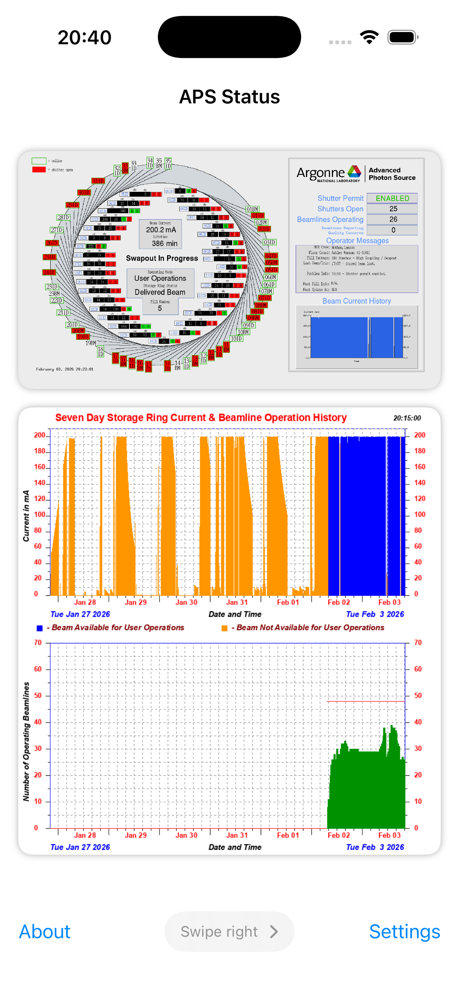

From the main page, selecting **Settings** opens the Settings page.

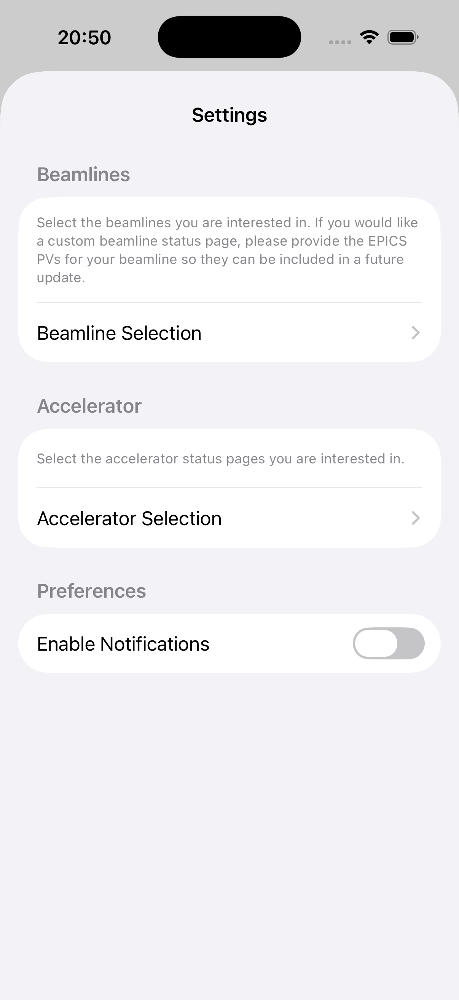

In Settings, the **Beamline** selection page allows choosing which beamline status pages
to view.

Settings also provides access to **accelerator (machine) specific** pages.

.. image:: docs/source/img/aps_status_settings_03.png
   :alt: APS Status Settings - accelerator pages selection
   :width: 30%

Always-present page
===================

In addition to the main page, the following page is always available in the application.

.. image:: docs/source/img/aps_status_02.png
   :alt: APS Status always-present page
   :width: 30%

Beamline-specific pages
=======================

These pages are specific to the selected beamline:

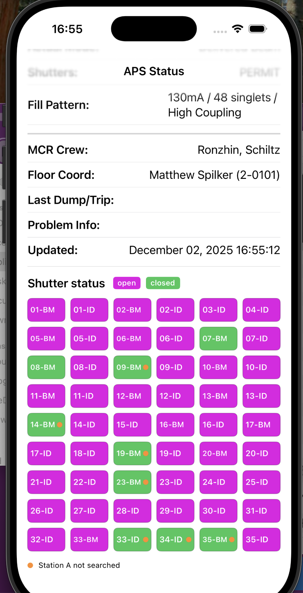

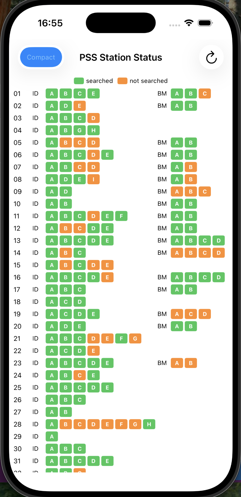

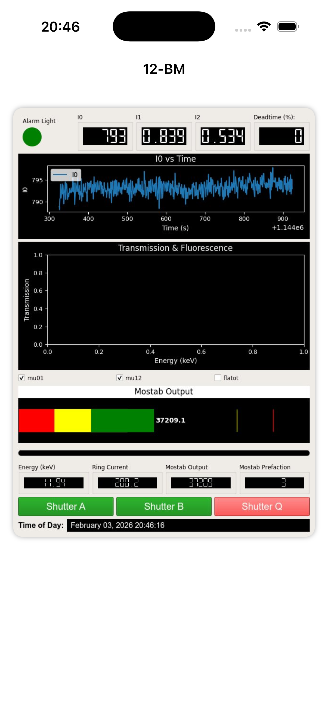

.. image:: docs/source/img/aps_status_06.png
   :alt: APS Status beamline page 4
   :width: 30%

Accelerator (machine) specific pages
====================================

These pages provide accelerator-wide (machine) status information:

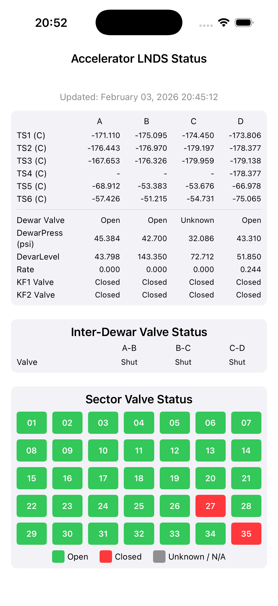

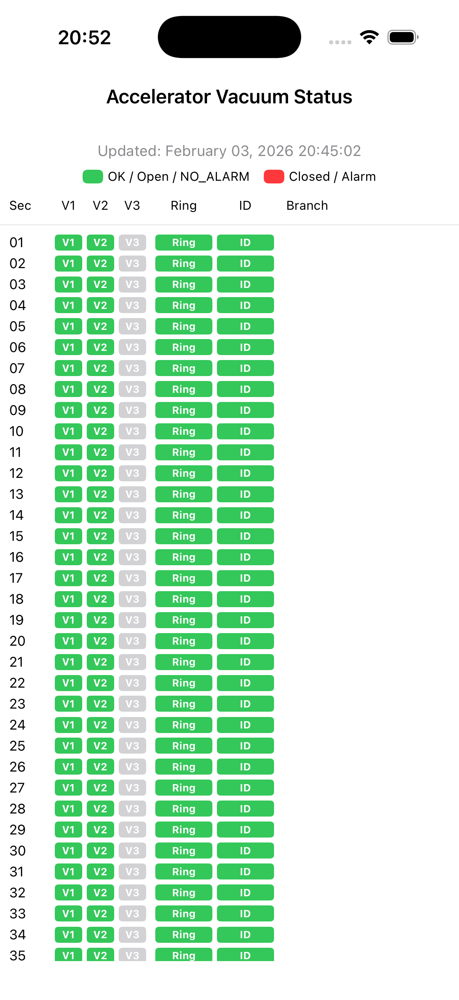

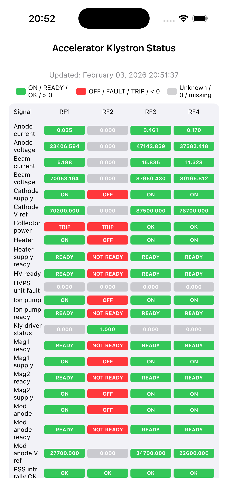

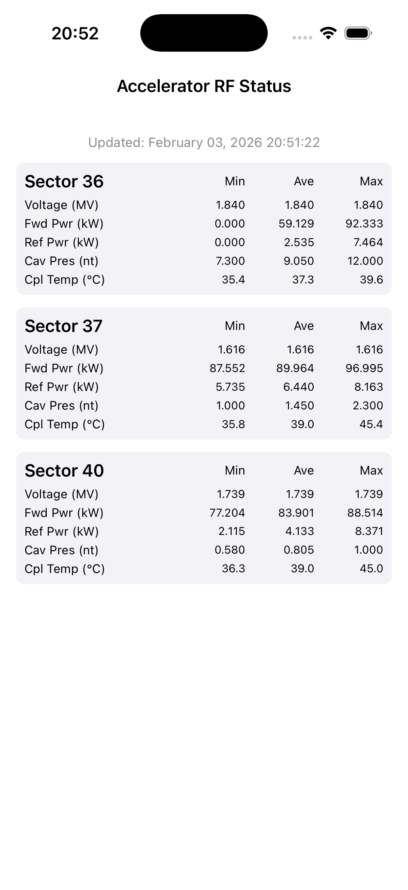

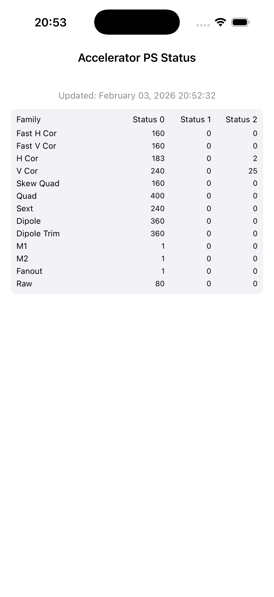

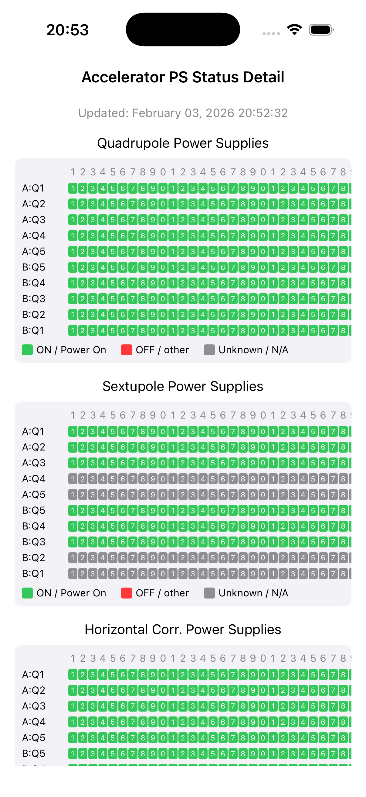

