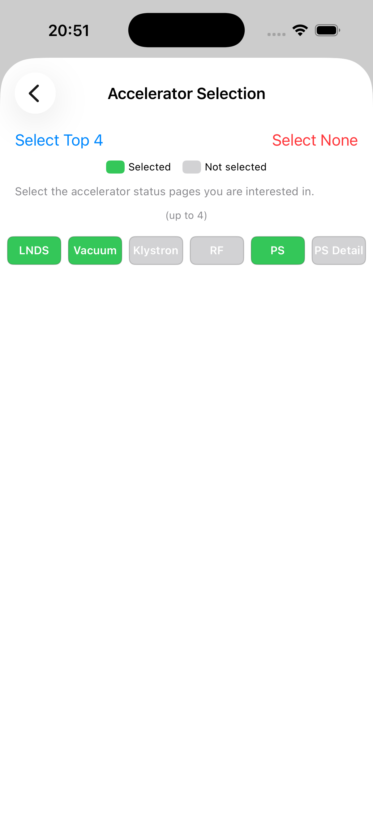
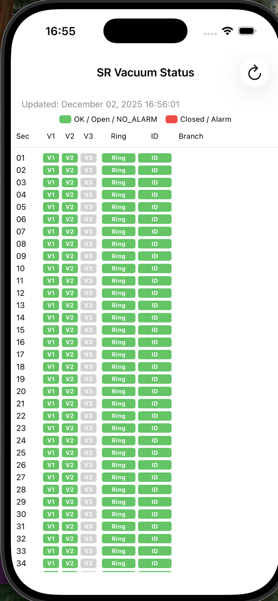

==========
APS Status
==========

This repository contains an APS Status user interface. The screenshots below walk through
the application in the same order a user typically encounters the pages.

.. note::
   All images are stored in ``docs/source/img`` and referenced from this top-level
   ``README.rst`` using relative paths.

Main page and always-present page
=================================

The main landing page (left) and the always-present page (right):

.. list-table::
   :widths: 50 50
   :class: borderless

   * - .. image:: docs/source/img/aps_status_01.png
          :alt: APS Status main page
          :width: 100%
     - .. image:: docs/source/img/aps_status_02.png
          :alt: APS Status always-present page
          :width: 100%

Settings workflow
=================

From the main page, selecting **Settings** opens the Settings page.

.. list-table::
   :widths: 50 50
   :class: borderless

   * - .. image:: docs/source/img/aps_status_settings_01.png
          :alt: APS Status Settings page
          :width: 100%
     - .. image:: docs/source/img/aps_status_settings_02.png
          :alt: APS Status Settings - beamline selection
          :width: 100%

Settings also provides access to **accelerator (machine) specific** pages.

Beamline-specific pages
=======================

These pages are specific to the selected beamline:

.. list-table::
   :widths: 50 50
   :class: borderless

   * - .. image:: docs/source/img/aps_status_03.png
          :alt: APS Status always-present page
          :width: 100%
     - .. image:: docs/source/img/aps_status_04.png
          :alt: APS Status beamline page 1
          :width: 100%

.. list-table::
   :widths: 50 50
   :class: borderless

   * - .. image:: docs/source/img/aps_status_05.png
          :alt: APS Status beamline page 2
          :width: 100%

Accelerator (machine) specific pages
====================================

These pages provide accelerator-wide (machine) status information:

.. list-table::
   :widths: 50 50
   :class: borderless

   * - .. image:: docs/source/img/aps_status_machine_01.png
          :alt: APS Status machine page 1
          :width: 100%
     - .. image:: docs/source/img/aps_status_machine_02.png
          :alt: APS Status machine page 2
          :width: 100%

.. list-table::
   :widths: 50 50
   :class: borderless

   * - .. image:: docs/source/img/aps_status_machine_03.png
          :alt: APS Status machine page 3
          :width: 100%
     - .. image:: docs/source/img/aps_status_machine_04.png
          :alt: APS Status machine page 4
          :width: 100%

.. list-table::
   :widths: 50 50
   :class: borderless

   * - .. image:: docs/source/img/aps_status_machine_05.png
          :alt: APS Status machine page 5
          :width: 100%
     - .. image:: docs/source/img/aps_status_machine_06.png
          :alt: APS Status machine page 6
          :width: 100%
